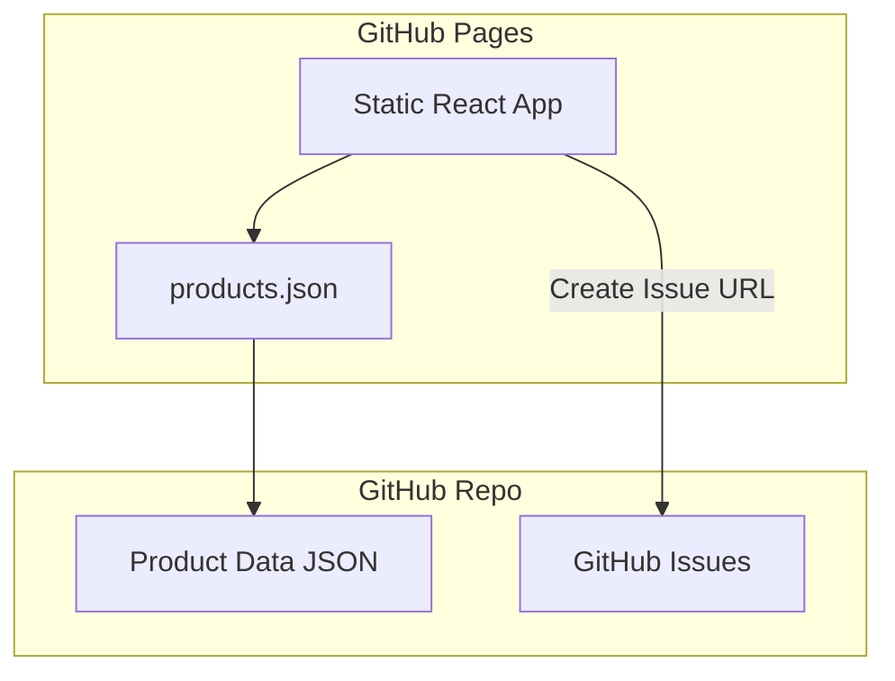

# Spirit Wolf Market - Static Site Conversion Plan

## Overview

Convert the Spirit Wolf Market from a full-stack Express/PostgreSQL application to a static site deployable on GitHub Pages, using JSON files for product data and GitHub Issues for purchase requests.

## Architecture



## Data Strategy

### Products - JSON File in Repo
- Store products as `public/data/products.json`
- Fetched client-side at runtime
- Easy to update via git commits

### Purchases - GitHub Issues
- When user clicks Purchase, open a pre-filled GitHub Issue URL
- No authentication required for public repos
- Issue template includes product details

## Implementation Steps

### Phase 1: Move Backend to Deprecated

1. Move these directories to `.deprecated/`:
   - `server/` - entire directory
   - `shared/` - entire directory
   - `script/` - build scripts for backend

2. Remove backend dependencies from `package.json`:
   - express, express-session, passport, passport-local
   - drizzle-orm, @neondatabase/serverless
   - bcrypt, connect-pg-simple

### Phase 2: Create Static Data

1. Create `client/public/data/products.json`:
```json
{
  "products": [
    {
      "id": 1,
      "name": "Spirit Wolf T-Shirt",
      "description": "Premium cotton t-shirt with Spirit Wolf logo",
      "price": 2999,
      "imageUrl": "/images/sprit-wolf-hero.png",
      "isSold": false
    }
  ]
}
```

2. Update `client/src/hooks/use-products.ts`:
   - Remove API calls
   - Fetch from `/data/products.json`
   - Use static data

### Phase 3: Remove Auth

1. Move to `.deprecated/`:
   - `client/src/hooks/use-auth.ts`
   - `client/src/lib/auth-utils.ts`

2. Update `client/src/components/Navbar.tsx`:
   - Remove login/logout buttons
   - Remove user display
   - Keep navigation links

3. Update `client/src/pages/ProductDetail.tsx`:
   - Remove auth check for purchase
   - Replace with GitHub Issue creation

### Phase 4: GitHub Issue Purchase Flow

1. Create purchase function:
```typescript
function createPurchaseIssue(product: Product) {
  const repoUrl = "https://github.com/YOUR_USERNAME/spirit-wolf-market";
  const title = encodeURIComponent(`Purchase Request: ${product.name}`);
  const body = encodeURIComponent(`
**Product:** ${product.name}
**Price:** $${(product.price / 100).toFixed(2)}
**Product ID:** ${product.id}

---
*This purchase request was created from the Spirit Wolf Market website.*
  `);
  
  window.open(`${repoUrl}/issues/new?title=${title}&body=${body}`, "_blank");
}
```

### Phase 5: Configure for GitHub Pages

1. Update `vite.config.ts`:
```typescript
export default defineConfig({
  base: "/spirit-wolf-market/", // GitHub repo name
  // ... rest of config
});
```

2. Create `.github/workflows/deploy.yml`:
```yaml
name: Deploy to GitHub Pages

on:
  push:
    branches: [main]

permissions:
  contents: read
  pages: write
  id-token: write

jobs:
  build-and-deploy:
    runs-on: ubuntu-latest
    steps:
      - uses: actions/checkout@v4
      
      - uses: actions/setup-node@v4
        with:
          node-version: "20"
          cache: "npm"
      
      - run: npm ci
      - run: npm run build
      
      - uses: actions/upload-pages-artifact@v3
        with:
          path: ./dist/public
      
      - uses: actions/deploy-pages@v4
```

### Phase 6: Update Package.json

1. Remove backend scripts
2. Update build script for static output
3. Remove backend dependencies

### Phase 7: Update Documentation

1. Update `README.md` for static deployment
2. Add instructions for updating products
3. Document GitHub Issue workflow

## File Changes Summary

### Files to Move to .deprecated
- `server/` (entire directory)
- `shared/` (entire directory)
- `script/` (entire directory)
- `client/src/hooks/use-auth.ts`
- `client/src/lib/auth-utils.ts`

### Files to Create
- `client/public/data/products.json`
- `.github/workflows/deploy.yml`

### Files to Modify
- `package.json` - Remove backend deps, update scripts
- `vite.config.ts` - Add base path for GitHub Pages
- `client/src/hooks/use-products.ts` - Static data fetching
- `client/src/components/Navbar.tsx` - Remove auth UI
- `client/src/pages/ProductDetail.tsx` - GitHub Issue purchase
- `README.md` - Update documentation

## Limitations

1. **No real purchases** - GitHub Issues are just requests
2. **No user accounts** - No login/logout
3. **No cart persistence** - Could add localStorage later
4. **Rate limits** - GitHub API has rate limits for unauthenticated requests

## Future Enhancements

1. Add localStorage cart
2. Use GitHub API to check product availability
3. Add GitHub Actions to auto-close issues when processed
